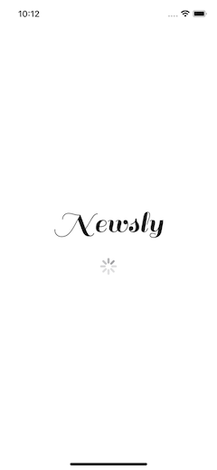
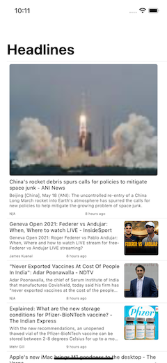

# Newsly

Newsly uses [newsapi.org](https://newsapi.org) to fetch news from your country. 
It shows a list of headlines, and clicking on one takes you to the news website.





The app is built using **MVVM architecture**  and SwiftUI framework.

#### Build Instructions
Create [your own API key](https://newsapi.org/register) . Place your API key at 
```swift
Constants.API_KEY
```
Build and run as usual 

